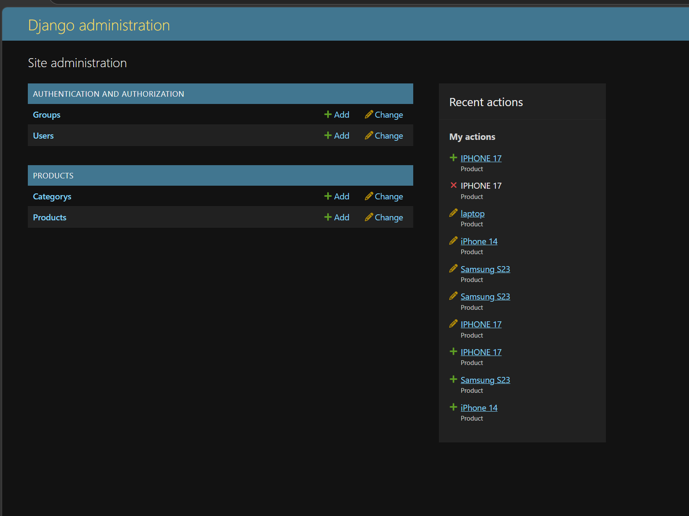
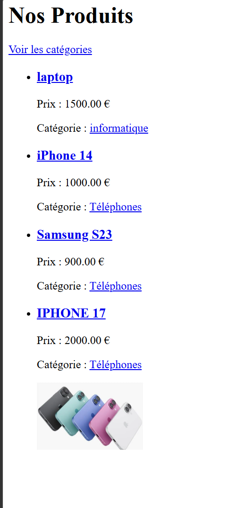
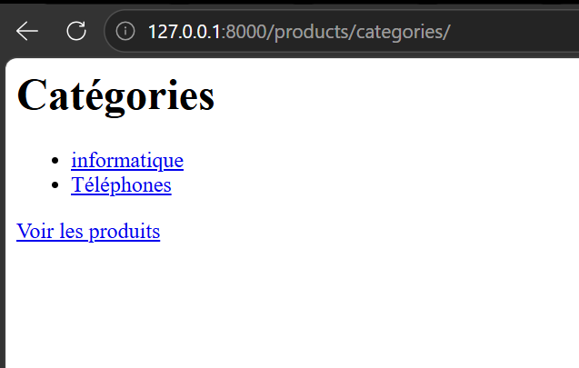

# E-commerce Django Project (Atelier 1 & 2)

Ce projet est une application e-commerce développée avec Django dans le cadre des ateliers d'apprentissage du développement web Python. Il permet de gérer un catalogue de produits organisés par catégories.

## 🚀 Fonctionnalités
- **Gestion des Produits** : Ajout, modification et suppression de produits (Nom, Description, Prix, Stock, Image).
- **Gestion des Catégories** : Organisation des produits par catégories thématiques.
- **Interface d'administration** : Utilisation de l'admin Django pour une gestion facile des données.
- **Vues Clients** : 
  - Liste de tous les produits.
  - Détails d'un produit spécifique.
  - Liste des catégories.
  - Produits par catégorie.

## 🛠️ Technologies utilisées
- **Python 3.14+**
- **Django 6.0.4**
- **Pillow** (Gestion des images)
- **SQLite** (Base de données de développement)
- **MySQL** (Supporté pour la production)

## 📸 Screenshots de l'application
*(Utilisez ce tableau pour insérer vos captures d'écran une fois ajoutées au projet)*

| Liste des Produits | Détail d'un Produit |
| :---: | :---: |
|  |  |

| Liste des Catégories | Administration Django |
| :---: | :---: |
|  |  |

## ⚙️ Installation et Utilisation

### 1. Prérequis
Assurez-vous d'avoir Python installé sur votre machine.

### 2. Installation
Clonez le dépôt et installez les dépendances :
```bash
# Créer l'environnement virtuel
python -m venv myenv

# Activer l'environnement (Windows)
.\myenv\Scripts\activate

# Installer les packages
pip install -r requirements.txt
```

### 3. Base de données
Appliquez les migrations pour créer les tables :
```bash
python ecommerce_project/ecommerce/manage.py migrate
```

### 4. Lancer l'application
```bash
python ecommerce_project/ecommerce/manage.py runserver
```
Accédez à l'application via : [http://127.0.0.1:8000/products/](http://127.0.0.1:8000/products/)

## 📂 Structure du dossier
- `Atelier1.pdf` & `Atelier2.pdf` : Énoncés des exercices.
- `ecommerce_project/` : Code source Django.
- `requirements.txt` : Liste des dépendances Python.
- `.gitignore` : Fichiers exclus de Git.

---
Projet réalisé dans le cadre du module **Développement Web Python 2025/2026**.
